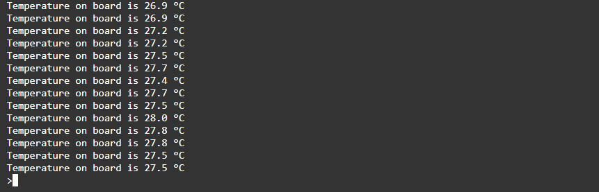

<div style = "font-family: 'Open Sans', sans-serif; font-size: 16px">

# ModuleSensorMCU

<div style = "color: #555">
    <p align="center">
    
    </p>
</div>

## Лицензия

<div style = "color: #555">

В разработке
</div>

## Описание
<div style = "color: #555">

Модуль предназначен для мониторинга состояния контроллера в рамках фреймворка EcoLite и обеспечивает следующий функционал:
- Мониторинг текущей температуры;
- Мониторинг памяти [не реализовано].

Модуль разработан в соответствии с [архитектурой сенсоров](https://github.com/Konkery/ModuleSensor/blob/main/README.md), соответственно, *ClassSensorMCU* наследует и реализует является функционал *ClassSensor*, а прикладная работа с данным модулем выполняется через *ClassChannelSensor*, который обеспечивает унифицированный интерфейс.

</div>

## Конструктор
<div style = "color: #555">

Конструктор принимает следующие данные из конфига:
```json
"MCU": {
    "name": "MCU",
    "type": "sensor",
    "channelNames": ["temperature"],
    "typeInSignal": "digital",
    "typeOutSignal": "digital",
    "quantityChannel": 1,
    "manufacturingData": {},
    "modules": ["ModuleSensorMCU.min.js"]
}
```

</div>

### Методы
<div style = "color: #555">

- <mark style="background-color: lightblue">Start(_chNum, _val)</mark> - запуск мониторинга выбранного канала;
- <mark style="background-color: lightblue">Off(_chNum, _opts)</mark> - прекращение мониторинга выбранного канала.

</div>

### Примеры
#### Мониторинг температуры
<div style = "color: #555">

```js
let mcu = SensorManager.CreateDevice('MCU');
mcu[0].Start(500);

let a = setInterval(() => {
    console.log(`Temperature on board is ${(mcu[0].Value).toFixed(1)} °C`);
}, 2000);

```

Результат выполнения:
<div align='left'>
    
</div>

</div>

### Зависимости
<div style = "color: #555">

</div>

</div>
